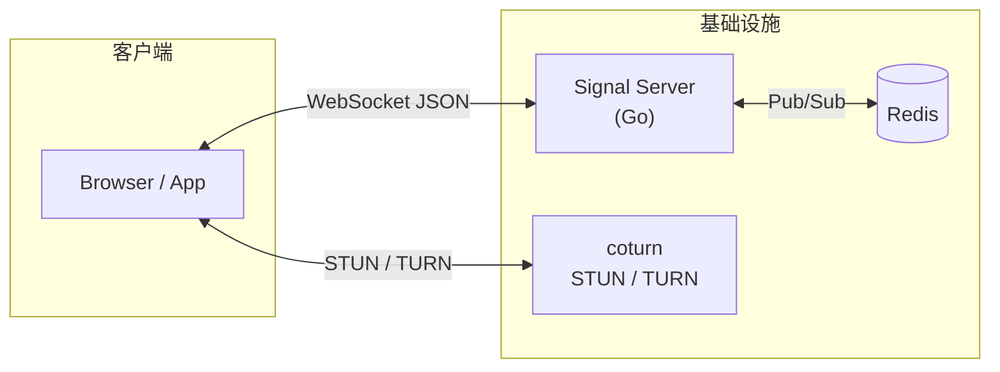
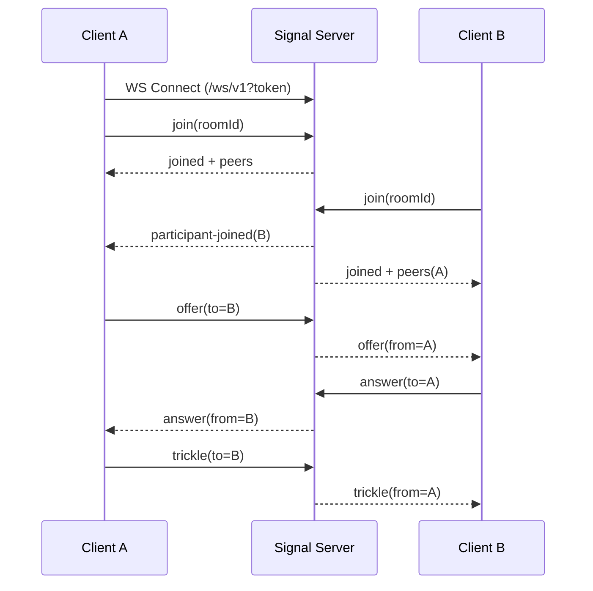

# 系统设计文档
{: .no_toc }

版本 v1 · 更新于 2025-10-25
{: .text-grey-dk-000 .fs-3 }

<details open markdown="block">
  <summary>目录</summary>
  {: .text-delta }
- TOC
{:toc}
</details>

---

## 1. 目标与范围

- 提供基于 WebRTC 的实时音视频信令服务（Signaling Server），负责房间与成员管理、会话协商（SDP/ICE）、基础控制（静音、文本消息等）。
- 支持场景：1v1、小规模群聊（2-16 人）为首要目标，后续可拓展至更大规模（>50）需结合 SFU。
- 传输与协议：WebSocket + JSON（默认），未来可扩展到 gRPC/WebTransport。
- 安全：鉴权、授权、速率限制、消息大小限制、TLS 终止、可选多租户隔离。
- 可运维性：结构化日志、指标、健康检查、分布式部署、水平扩展。

{: .note }
> **非目标（v1）**：不负责媒体转发（非 SFU/MCU）；不提供录制/回放；不内置 E2E 加密（沿用 SRTP）；不含聊天室/文件传输等增强功能。

## 2. 术语

| 术语 | 定义 |
|:--|:--|
| **Peer / Participant** | 房间内的终端参与者 |
| **Room** | 会话空间，包含多个 Participant |
| **SDP** | 会话描述协议，用于媒体/编解码协商 |
| **ICE Candidate** | 穿透网络所需的候选地址信息 |
| **STUN / TURN** | NAT 穿透与中继服务 |

## 3. 典型用例

- **1v1 视频通话** — 咨询、客服、面试
- **小班课 / 小会议** — ≤16 人
- **低延迟语音房** — 主持人 + 少量连麦

## 4. 架构总览

| 组件 | 职责 |
|:--|:--|
| **Signal Server（Go）** | HTTP + WebSocket，房间/成员状态、协议分发、鉴权 |
| **Redis（可选）** | 跨实例房间/成员状态与消息分发（Pub/Sub） |
| **coturn（STUN/TURN）** | 为客户端下发 ICE 配置，解决复杂 NAT |
| **Prometheus** | 指标采集、告警 |



**部署形态**：

- **单节点** — 无需 Redis，适合开发 / 小规模
- **多节点** — Redis 广播房间事件，所有节点可接入同一房间

## 5. 运行时行为与数据流

1. 获取 **Join Token**（业务后端或信令服务签发）
2. 客户端发起 WebSocket 连接：`/ws/v1?token=...`
3. **JOIN** — 发送 `join`，服务校验并返回 `joined` + 成员列表
4. **信令交换** — `offer` / `answer` / `trickle` 在指定对端间路由
5. **控制消息** — `mute` / `unmute` / `leave` / `chat`
6. **断线** — 心跳超时或 `leave`，清理状态并广播 `participant-left`



## 6. 数据模型（内存 / Redis）

### Room

| 字段 | 类型 | 说明 |
|:--|:--|:--|
| `id` | string | 外部自定义或服务生成 |
| `metadata` | object | 任意 JSON（业务扩展） |
| `maxParticipants` | int | 上限，默认 16 |
| `createdAt` | time | 创建时间 |
| `updatedAt` | time | 更新时间 |

### Participant

| 字段 | 类型 | 说明 |
|:--|:--|:--|
| `id` | string | 连接维度唯一 |
| `userId` | string | 业务用户标识（来自 Token） |
| `role` | string | `viewer` / `speaker` / `moderator` |
| `conn` | ws.Conn | WebSocket 句柄（仅内存） |
| `joinedAt` | time | 加入时间 |
| `lastSeenAt` | time | 最后活跃时间 |

### 消息信封（Envelope）

```json
{
  "id": "uuid-optional",
  "version": "v1",
  "type": "join|joined|offer|answer|trickle|leave|...",
  "roomId": "r-123",
  "from": "p-a",
  "to": "p-b|*|null",
  "ts": 1730000000,
  "payload": {}
}
```

- **广播** — `to` 省略或 `*`，服务决定广播范围（全房间或排除自身）
- **幂等** — 客户端可带 `id`，服务按连接维度去重（可选）

## 7. 协议定义（WebSocket JSON）

**通用规则**：
- **心跳** — 服务端每 10s 发送 ping，客户端需在 25s 内 pong
- **限流** — 连接级 QPS（默认 20）与速率桶；消息上限 64 KB
- **错误** — 统一 `error` 消息类型

### 客户端 → 服务端

| 类型 | payload | 说明 |
|:--|:--|:--|
| `join` | `{ roomId, displayName?, role? }` | 加入房间 |
| `offer` | `{ to, sdp }` | SDP Offer |
| `answer` | `{ to, sdp }` | SDP Answer |
| `trickle` | `{ to, candidate }` | ICE 候选 |
| `chat` | `{ to?, text }` | 文本消息 |
| `mute` / `unmute` | `{ target? }` | 静音控制 |
| `leave` | — | 离开房间 |

### 服务端 → 客户端

| 类型 | payload | 说明 |
|:--|:--|:--|
| `joined` | `{ self, peers[], iceServers[] }` | 加入成功 + 成员列表 |
| `participant-joined` | `{ id, displayName, role }` | 新成员通知 |
| `participant-left` | `{ id }` | 成员离开通知 |
| `offer` / `answer` / `trickle` | 同上 | 转发对端 |
| `chat` | `{ text }` | 转发文本 |
| `mute-request` | `{ target? }` | 静音请求 |
| `error` | `{ code, message, details? }` | 错误 |

### 错误码

| 码 | 含义 | 说明 |
|:--|:--|:--|
| 2001 | `invalid_message` | 消息格式不合法 |
| 2002 | `unauthorized` | 未认证或 Token 过期 |
| 2003 | `forbidden` | 权限不足 |
| 2004 | `room_not_found` | 房间不存在 |
| 2005 | `member_not_found` | 目标成员不存在 |
| 2006 | `unsupported_type` | 不支持的消息类型 |
| 2007 | `rate_limited` | 超出速率限制 |
| 2008 | `room_full` | 房间已满 |
| 2009 | `version_mismatch` | 协议版本不匹配 |
| 2010 | `bad_state` | 状态异常 |
| 3000 | `internal_error` | 服务端内部错误 |

完整请求/响应示例参阅 [API 参考]()。

## 8. REST API

详见 [API 参考]()，此处仅列端点摘要。

| 方法 | 路径 | 说明 |
|:--|:--|:--|
| `POST` | `/api/v1/rooms` | 创建房间 |
| `GET` | `/api/v1/rooms/{id}` | 查询房间 |
| `POST` | `/api/v1/rooms/{id}/join-token` | 签发 Join Token（JWT） |
| `GET` | `/api/v1/ice-servers` | ICE 服务器配置 |
| `GET` | `/healthz` · `/readyz` · `/metrics` | 探针与指标 |

**鉴权**：管理 API 使用 Admin Key（可选）；WebSocket 使用 JWT。

## 9. 安全与合规

### JWT

- 算法：HS256（默认）/ RS256
- Claims：`sub`（userId）、`rid`（roomId）、`role`、`tenant?`、`exp`、`iat`、`nbf`
- 有效期：5–30 分钟（可配）

### 授权模型

| 角色 | 权限 |
|:--|:--|
| `viewer` | 仅接收/发送面向自身的信令 |
| `speaker` | 可发起 offer / answer / trickle |
| `moderator` | 可踢人、静音他人、关闭房间 |

### 防护措施

- **速率限制** — IP 与 Token 级
- **消息大小限制** — 默认 64 KB
- **CORS** — 仅允许受信 Origin
- **TLS** — 生产环境强制 HTTPS / WSS
- **多租户（可选）** — `tenantId` 命名空间隔离与 Redis key 前缀

## 10. 扩展性与可用性

- **无状态服务** — 连接状态驻留内存；跨实例事件通过 Redis 同步
- **Redis Key 设计**：
  - `room:{id}` — 房间元数据
  - `room:{id}:peers`（Set）— 成员 ID 集合
  - `peer:{id}`（Hash，可选）— 成员详情
- **Redis Channel**：
  - `chan:room:{id}` — 房间广播
  - `chan:peer:{id}` — 定向消息
- **连接路由** — 任何节点可承载房间的部分连接，消息按 `to` 定向本地或经 Redis 转发
- **退避与重连** — 客户端断线后 `resume`（未来版本）
- **灰度发布** — 按房间或租户做流量切分（可选）

## 11. 可观测性

### 日志

JSON 结构化，字段：`ts`、`level`、`msg`、`reqId`、`connId`、`roomId`、`peerId`

### 指标（Prometheus，namespace `signal_`）

| 指标 | 类型 | 说明 |
|:--|:--|:--|
| `ws_connections` | Gauge | 当前 WebSocket 连接数 |
| `rooms` | Gauge | 当前房间数 |
| `participants` | Gauge | 当前参与者数 |
| `messages_in_total` | Counter | 入站消息计数 |
| `messages_out_total` | Counter | 出站消息计数 |
| `message_bytes_in_total` | Counter | 入站字节数 |
| `message_bytes_out_total` | Counter | 出站字节数 |
| `message_latency_ms` | Histogram | 消息处理延迟 |
| `errors_total` | Counter | 错误计数（按 code 标签） |

### Tracing

OpenTelemetry（可选）。

## 12. 配置

支持**环境变量**（当前实现）与 YAML（规划中）。

环境变量列表见 [API 参考 — 配置](#配置环境变量)。

YAML 配置示例（规划）：

```yaml
server:
  addr: ":8080"
  allowedOrigins: ["https://example.com"]
  maxMsgBytes: 65536
security:
  jwt:
    algo: "HS256"
    secret: "change-me"
  adminKey: "changeme-admin"
  rateLimit: { wsPerIpRps: 10, wsBurst: 20 }
redis:
  enabled: true
  addr: "redis:6379"
turn:
  stun: ["stun:stun.l.google.com:19302"]
  turn:
    - urls: ["turn:turn.example.com:3478"]
      username: "turnuser"
      credential: "turnpass"
      ttl: 600
```

## 13. 部署

| 方式 | 说明 |
|:--|:--|
| **Docker** | `Dockerfile`，Distroless 运行时（`gcr.io/distroless/static-debian12`） |
| **Docker Compose** | `signal + redis + coturn`，一键本地启动 |
| **Kubernetes（生产）** | Deployment + HPA + ConfigMap/Secret + Service + Ingress |

**端口**：

| 端口 | 用途 |
|:--|:--|
| 8080 | HTTP / WebSocket |
| 9090 | Prometheus 指标（可选） |
| 3478 / 5349 | coturn STUN / TURN + 中继端口范围 |

## 14. 开发与测试

- **单元测试** — 协议路由、校验、权限、限流
- **集成测试** — WebSocket 端到端（`offer` / `answer` / `trickle` 流程）
- **压测** — k6 脚本（连接并发、消息吞吐、房间广播）
- **本地演示** — Web 前端 Demo（纯浏览器 WebRTC）

## 15. 渐进式里程碑

| 阶段 | 范围 |
|:--|:--|
| **M1（MVP）** | 单节点、1v1、`join` / `offer` / `answer` / `trickle` / `leave`、JWT 鉴权、STUN |
| **M2** | 群聊（≤16）、Redis 扩展、可观测性、TURN |
| **M3** | 管理 API、权限角色、限流、Docker / K8s、Web Demo |

## 16. 风险与缓解

| 风险 | 缓解措施 |
|:--|:--|
| 移动网络 / NAT 复杂 | 务必提供 TURN，默认启用 STUN |
| 浏览器兼容 | 使用标准 SDP / ICE，跟随 Chrome / Firefox / Safari 变化测试 |
| 资源滥用 | 限流、鉴权、最大房间规模限制 |
| Redis 故障 | 本地降级（仅同节点通信）、告警与自动故障转移 |

## 17. 代码结构

```
cmd/
  server/main.go            # 入口
internal/
  httpapi/                   # REST + WebSocket 路由
  signaling/                 # 协议编解码、路由、会话
  room/                      # 房间/成员状态与生命周期
  auth/                      # JWT / 权限
  store/                     # Redis 封装（可选）
  observability/             # 日志、指标
  config/                    # 配置加载与校验
  logger/                    # 结构化日志
docs/                        # 本文档及 API 参考
docker/                      # docker-compose 编排
k6/                          # 压测脚本
web/                         # Web Demo 前端
```

## 18. 参考

- [WebRTC 标准](https://www.w3.org/TR/webrtc/) · [ICE RFC 8445](https://datatracker.ietf.org/doc/html/rfc8445) · [coturn](https://github.com/coturn/coturn)
- 高可用 WebSocket 集群实践（Redis Pub/Sub、Sharding）

---

## 附录

### A. 最小消息白名单

`join` · `joined` · `participant-joined` · `participant-left` · `offer` · `answer` · `trickle` · `leave` · `chat` · `mute` · `unmute` · `error`

### B. 约束

| 约束 | 默认值 |
|:--|:--|
| 单消息大小 | ≤ 64 KB |
| 单连接 QPS | ≤ 20 |
| 单房间参与者 | ≤ 16 |
| 服务器最大连接数 | 依赖实例规格 |
