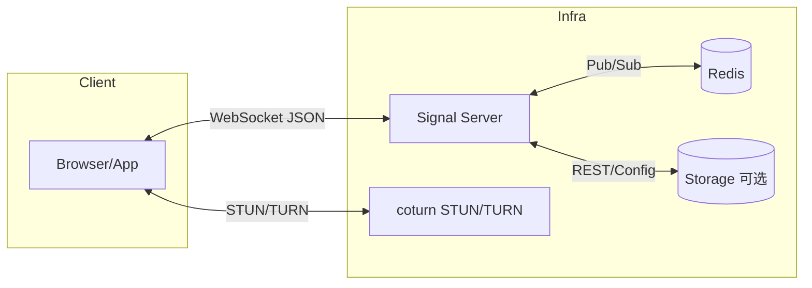
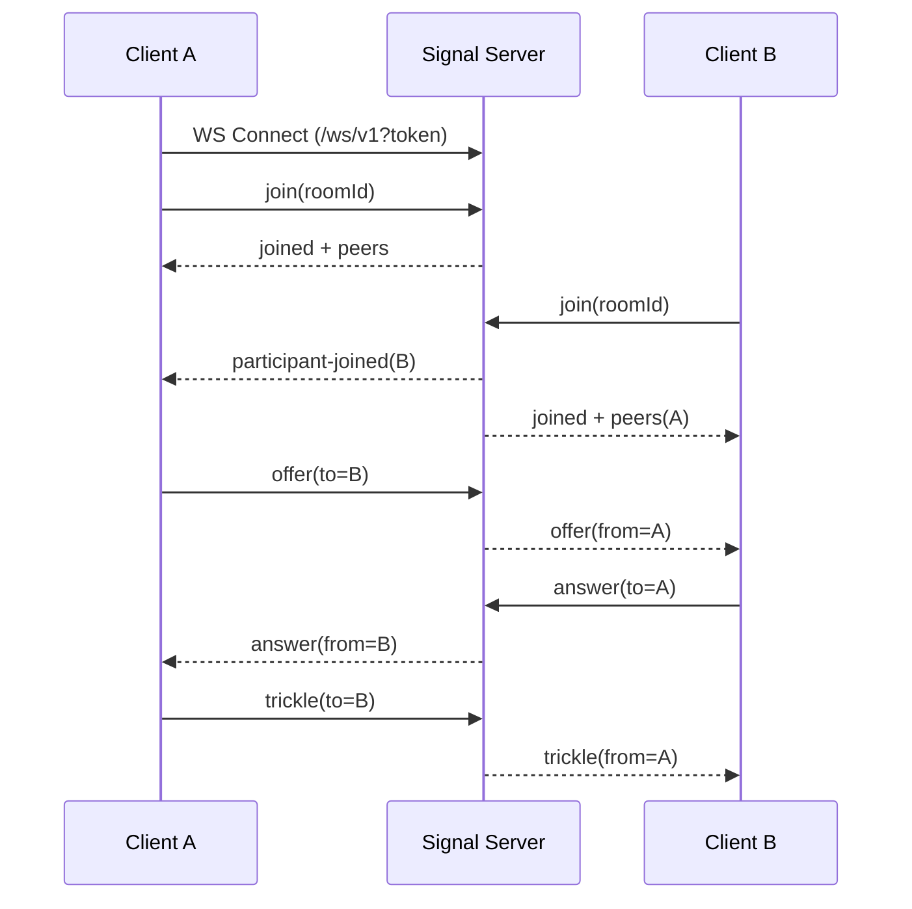

# 实时音视频信令服务（Go）系统设计文档

版本：v1

作者：Cascade 助手

更新时间：2025-10-25

---

## 1. 目标与范围

- 提供基于 WebRTC 的实时音视频信令服务（Signaling Server），负责房间与成员管理、会话协商（SDP/ICE）、基础控制（静音、文本消息等）。
- 支持场景：1v1、小规模群聊（2-16 人）为首要目标，后续可拓展至更大规模（>50）需结合 SFU。
- 传输与协议：WebSocket + JSON（默认），未来可扩展到 gRPC/WebTransport。
- 安全：鉴权、授权、速率限制、消息大小限制、TLS 终止、可选多租户隔离。
- 可运维性：结构化日志、指标、健康检查、分布式部署、水平扩展。

非目标（v1）：
- 不负责媒体转发/混流（非 SFU/MCU），仅信令。
- 不提供录制/回放。
- 不内置端到端加密方案（沿用 WebRTC SRTP）。
- 不内置复杂聊天室/文件传输等增强功能（可通过 DataChannel 自行扩展）。

## 2. 术语

- Peer/Participant：房间内的终端参与者。
- Room：会话空间，包含多个 Participant。
- SDP：会话描述，用于媒体/编解码协商。
- ICE Candidate：穿透网络所需的候选地址信息。
- STUN/TURN：NAT 穿透与中继服务。

## 3. 典型用例

- 1v1 视频通话（咨询、客服、面试）。
- 小班课/小会议（<=16）。
- 低延迟语音房（主持人+少量连麦）。

## 4. 架构总览

组件：
- Signal Server（Go）：HTTP+WebSocket，房间/成员状态、协议分发、鉴权与权限校验。
- Redis（可选但推荐）：跨实例的房间/成员状态与消息分发（Pub/Sub），支持水平扩展。
- STUN/TURN（coturn）：为客户端下发 ICE 服务器配置，解决复杂 NAT。
- 可观测性：Prometheus 指标、结构化日志、健康检查。



部署形态：
- 单节点：无需 Redis，适合开发/小规模。
- 多节点：使用 Redis 做房间存在与事件广播，所有节点可接入同一房间的不同连接。

## 5. 运行时行为与数据流

关键流程：
1) 获取 Join Token（由业务后端或信令服务签发）。
2) 客户端发起 WebSocket 连接：`/ws/v1?token=...`。
3) JOIN：客户端发送 `join`，服务完成授权校验与房间接入，返回 `joined` 与当前房间成员列表。
4) 信令交换：`offer`/`answer`、`trickle`（ICE）在指定对端之间路由分发。
5) 控制消息：`mute/unmute/leave/chat` 等。
6) 断线：心跳超时或显式 `leave`，服务清理状态并广播 `participant-left`。



## 6. 数据模型（内存/Redis）

Room：
- id：字符串（外部可自定义或服务生成）。
- metadata：任意 JSON（业务扩展）。
- maxParticipants：上限（默认 16）。
- createdAt、updatedAt。

Participant：
- id：字符串（连接维度唯一）。
- userId：业务用户标识（来自 Token）。
- role：viewer/speaker/moderator（权限控制）。
- conn：WebSocket 连接句柄（仅内存）。
- joinedAt、lastSeenAt。

消息信封（Envelope）：
```json
{
  "id": "uuid-optional",
  "version": "v1",
  "type": "join|joined|offer|answer|trickle|leave|...",
  "roomId": "r-123",
  "from": "p-a",
  "to": "p-b|*|null",
  "ts": 1730000000,
  "payload": {}
}
```

- 广播：`to` 省略或 `*`，由服务决定广播范围（全房间或排除自身）。
- 幂等：客户端可带 `id`，服务按连接维度做去重（可选）。

## 7. 协议定义（WebSocket JSON）

通用：
- 心跳：服务端每 15s 发送 ping（或开启 WebSocket ping），客户端需在 5s 内响应。
- 限流：连接级 QPS 与速率桶；消息大小上限（默认 64KB）。
- 错误：统一 `error` 消息类型。

消息类型：
- 客户端 → 服务端
  - `join`：加入房间
    - payload：`{ roomId, displayName?, role? }`
  - `offer`：SDP Offer
    - payload：`{ to, sdp }`
  - `answer`：SDP Answer
    - payload：`{ to, sdp }`
  - `trickle`：ICE 候选
    - payload：`{ to, candidate }`
  - `leave`：离开房间
  - `mute`/`unmute`：请求自身或对端静音（需权限）
    - payload：`{ target?: to }`
  - `chat`：文本消息
    - payload：`{ to?: peerId, text }`

- 服务端 → 客户端
  - `joined`：加入成功 + 当前成员列表
    - payload：`{ self: {id, role}, peers: [{id, role, displayName}], iceServers: [...] }`
  - `participant-joined`：新成员加入通知
  - `participant-left`：成员离开通知
  - `offer`/`answer`/`trickle`：转发对端消息
  - `mute-request`：对端或系统请求静音
  - `chat`
  - `error`：错误
    - payload：`{ code, message, details? }`

错误码建议：
- 2001 invalid_message
- 2002 unauthorized
- 2003 forbidden
- 2004 room_not_found
- 2005 member_not_found
- 2006 unsupported_type
- 2007 rate_limited
- 2008 room_full
- 2009 version_mismatch
- 2010 bad_state
- 3000 internal_error

示例：`join`
```json
{
  "version": "v1",
  "type": "join",
  "payload": {"roomId": "room-001", "displayName": "Alice"}
}
```

示例：`offer`
```json
{
  "version": "v1",
  "type": "offer",
  "to": "p-b",
  "payload": {"sdp": "v=0..."}
}
```

错误示例：
```json
{
  "version": "v1",
  "type": "error",
  "payload": {"code": 2003, "message": "forbidden"}
}
```

## 8. REST API（管理与鉴权）

BasePath: `/api/v1`

- POST `/rooms`
  - body：`{ id?: string, maxParticipants?: number, metadata?: object }`
  - 201：`{ id, maxParticipants, metadata }`
- GET `/rooms/{id}`
  - 200：`{ id, participants: number, maxParticipants, metadata }`
- POST `/rooms/{id}/join-token`
  - body：`{ userId, displayName?, role? }`
  - 200：`{ token, expiresAt }`（JWT，含 rid/role/sub）
- GET `/ice-servers`
  - 200：`[{ urls: ["stun:..."], username?: "...", credential?: "...", ttl?: 600 }]`
- GET `/healthz`、`/readyz`、`/metrics`

鉴权：
- 管理 API 可使用管理密钥（HMAC）或 OAuth2（可扩展）。
- WebSocket 使用 Join Token（JWT）。

## 9. 安全与合规

- JWT（RS256 或 HS256）：
  - claim：`sub`(userId), `rid`(roomId), `role`, `tenant?`, `exp`, `iat`, `nbf`。
  - 最短有效期：5-30 分钟；可配。
- 授权模型：
  - viewer：仅接收/发送面向自身或允许的对端信令。
  - speaker：可发起 offer/answer/trickle。
  - moderator：可踢人、静音他人、关闭房间。
- 速率限制：IP 与 Token 级。
- 消息大小限制：默认 64KB。
- CORS：仅允许受信来源。
- TLS：生产环境强制 HTTPS/WSS。
- 多租户（可选）：隔离 `tenantId` 命名空间与 Redis key 前缀。

## 10. 扩展性与可用性

- 无状态服务：连接状态驻留内存；跨实例事件通过 Redis 同步。
- Redis：
  - Key：`room:{id}`, `room:{id}:peers`（Set），`peer:{id}`（Hash，可选）。
  - Channel：`chan:room:{id}`（广播），`chan:peer:{id}`（定向）。
- 连接路由：任何节点都可承载房间的一部分连接；消息根据 `to` 定向本地或经 Redis 转发。
- 退避与重连：客户端断线重连上报 `resume`（未来版本）。
- 灰度发布：按房间或租户做流量切分（可选）。

## 11. 可观测性

- 日志：JSON 结构化，字段：`ts, level, msg, reqId, connId, roomId, peerId`。
- 指标（Prometheus）：
  - `ws_connections{tenant}`
  - `rooms{tenant}`
  - `participants{tenant}`
  - `messages_in_total`, `messages_out_total`
  - `message_bytes_in_total`, `message_bytes_out_total`
  - `message_latency_ms`（直方图）
  - `errors_total{code}`
- Tracing：OpenTelemetry（可选）。

## 12. 配置

支持 ENV/YAML：
```yaml
server:
  addr: ":8080"
  allowedOrigins:
    - "https://example.com"
  readTimeoutSec: 10
  writeTimeoutSec: 10
  maxMsgBytes: 65536
security:
  jwt:
    algo: "RS256" # or HS256
    publicKeyFile: "config/jwt_pub.pem"
    privateKeyFile: "config/jwt_priv.pem"
  adminKey: "changeme-admin"
  rateLimit:
    wsPerIpRps: 10
    wsBurst: 20
redis:
  enabled: true
  addr: "redis:6379"
  db: 0
  password: ""
turn:
  stun:
    - "stun:stun.l.google.com:19302"
  turn:
    - urls: ["turn:turn.example.com:3478"]
      username: "turnuser"
      credential: "turnpass"
      ttl: 600
observability:
  prometheus:
    enabled: true
    addr: ":9090"
```

## 13. 部署

- Docker：提供 `Dockerfile`，二进制小体积（`FROM gcr.io/distroless/base-debian12`）。
- Docker Compose（本地）：`signal + redis + coturn`。
- 生产：Kubernetes（Deployment + HPA + ConfigMap/Secret + Service + Ingress）。

端口与暴露：
- 8080：HTTP/WS。
- 9090：指标（可选）。
- coturn：3478/5349 + 中继端口范围。

## 14. 开发与测试

- 单元测试：协议路由、校验、权限、限流。
- 集成测试：WebSocket 端到端（`offer/answer/trickle` 流程）。
- 压测：k6 脚本（连接并发、消息吞吐、房间广播）。
- 本地演示：Web 前端 Demo（纯浏览器 WebRTC）。

## 15. 渐进式里程碑

- M1（MVP）：
  - 单节点、1v1、`join/offer/answer/trickle/leave`、JWT 鉴权、STUN。
- M2：
  - 群聊、Redis 扩展、可观测性、TURN。
- M3：
  - 管理 API、权限角色、限流、Docker/K8s、Demo 前端。

## 16. 风险与缓解

- 移动网络/NAT 复杂：务必提供 TURN，默认启用 STUN。
- 浏览器兼容：使用标准 SDP/ICE；跟随 Chrome/Firefox/Safari 变化测试。
- 资源滥用：加大限流、鉴权、最大房间规模限制。
- Redis 故障：本地降级（仅同节点通信可用）、告警与自动故障转移。

## 17. 开放问题（请确认）

- 规模目标：并发连接与单房间最大参与者数？（默认 10k 并发、房间 16）
- 是否需要持久化房间与审计日志？（默认仅内存 + 可选 Redis，持久化关闭）
- 鉴权来源：由业务后端签发 Join Token，还是信令服务自签？
- 多租户：是否需要 `tenantId` 隔离？
- TURN：是否已有 coturn 实例与 REST API？若无，是否由本项目一并提供 compose？
- 前端 Demo：是否需要内置一个最小可用的 Web 示例？

## 18. 代码结构（拟定）

```
/ (repo root)
  cmd/
    server/
      main.go
  internal/
    httpapi/        # REST + WebSocket 入口
    signaling/      # 协议编解码、路由、会话
    room/           # 房间/成员状态与生命周期
    auth/           # JWT/权限
    store/          # Redis 封装（可选）
    observability/  # 日志、指标
    config/         # 配置加载与校验
  pkg/
    errors/
    logger/
    utils/
  docs/
    design.md
  docker/
    docker-compose.yml (后续)
```

## 19. 接口草案（简版）

WebSocket 路径：`/ws/v1`
- Header：`Authorization: Bearer <JoinToken>` 或 URL Query `?token=`

REST 摘要：
- `POST /api/v1/rooms`
- `GET /api/v1/rooms/{id}`
- `POST /api/v1/rooms/{id}/join-token`
- `GET /api/v1/ice-servers`
- `GET /healthz|/readyz|/metrics`

## 20. 参考

- WebRTC 标准、ICE RFC、coturn 文档。
- 高可用 WebSocket 集群实践（Redis Pub/Sub、Sharding）。

---

附录 A：最小消息白名单
- join, joined, participant-joined, participant-left, offer, answer, trickle, leave, chat, mute, unmute, error

附录 B：约束
- 单消息 <= 64KB；单连接 QPS 默认 <= 20；房间 <= 16；Server 默认最大连接数依赖实例规格。
