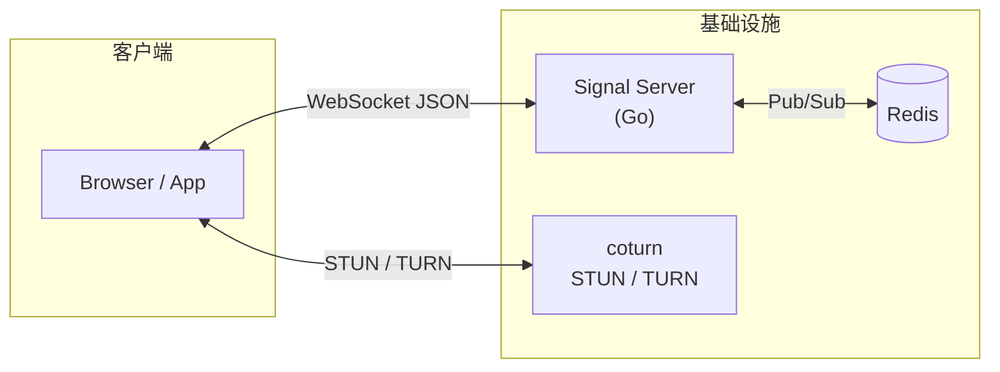

# Aurora Signal
{: .fs-9 }

基于 Go 1.23 的 **WebRTC 信令服务**，提供房间管理、会话协商（SDP / ICE）与基础控制。
{: .fs-6 .fw-300 }

[快速开始](#快速开始){: .btn .btn-primary .fs-5 .mb-4 .mb-md-0 .mr-2 }
[API 参考](){: .btn .fs-5 .mb-4 .mb-md-0 }

---

## 特性一览

| 能力 | 说明 |
|:--|:--|
| **房间管理** | REST API 创建 / 查询房间，`maxParticipants` 人数上限，空房自动清理 |
| **WebSocket 信令** | offer / answer / trickle / chat / mute / leave，消息自动填充 `id` + `ts` |
| **安全** | JWT 认证、Admin Key 常量时间比较、速率限制、安全响应头 |
| **可观测性** | Prometheus 指标（`signal_`）、结构化 JSON 日志、Request-ID 追踪 |
| **高可用** | Redis Pub/Sub 多节点扩展、graceful shutdown、panic recovery |
| **容器化** | ldflags 版本注入、OCI 标签、Distroless 运行时 |
| **Web Demo** | 断线退避重连、连接状态指示、Enter 发送聊天 |

---

## 架构概览



- **单节点** — 无需 Redis，适合开发与小规模部署
- **多节点** — Redis 广播房间事件，所有节点可接入同一房间

---

## 快速开始

```bash
# 1. 设置 JWT Secret（必填）
export SIGNAL_JWT_SECRET="dev-secret-change"

# 2. 启动服务
make run            # 或 go run ./cmd/server

# 3. 打开 Demo — http://localhost:8080/demo
#    输入房间 ID + 显示名，新开窗口重复操作即可 1v1 实测
```

{: .tip }
使用 Docker Compose 可一键启动 Signal + Redis + coturn：`cd docker && docker compose up --build`

---

## REST API 速览

| 方法 | 路径 | 说明 |
|:--|:--|:--|
| `POST` | `/api/v1/rooms` | 创建房间 |
| `GET` | `/api/v1/rooms/{id}` | 查询房间 |
| `POST` | `/api/v1/rooms/{id}/join-token` | 签发 Join Token |
| `GET` | `/api/v1/ice-servers` | ICE 服务器配置 |
| `GET` | `/healthz` | 存活探针 |
| `GET` | `/readyz` | 就绪探针 |
| `GET` | `/metrics` | Prometheus 指标 |

**WebSocket**：`GET /ws/v1?token=<JWT>`  

完整请求 / 响应示例 → [API 参考]()

---

## 文档

| 页面 | 内容 |
|:--|:--|
| [API 参考]() | REST 端点与 WebSocket 信令协议完整说明 |
| [系统设计]() | 架构、数据模型、协议定义、部署与里程碑 |
| [变更日志]() | 版本发布历史 |
| [贡献指南]() | 开发环境、分支规范与提交流程 |
| [安全策略]() | 漏洞报告与处理流程 |

---

## 许可证

[MIT License](https://github.com/LessUp/aurora-signal/blob/main/LICENSE) &copy; 2025 LessUp
